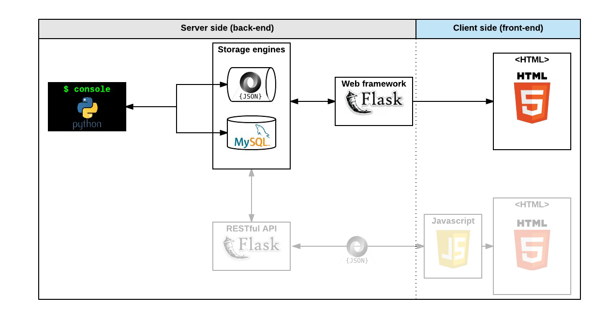

# web flask

backend
├── app.py
└── templates - main application file
├── index.html    - home page  template
│   └── __init__.py         - makes the module executable
├── templates               - directory for HTML templates
│    └── index.html        - home page template
│     └── login.html       - login page template
│     └── register.html    - registration page template
│     └── dashboard.html     - user's dashboard page template
│     └── add_product.html  - adding a new product to inventory page
│     └── manage_products.html- managing existing products in inventory page
│
├── static                 - directory for static files (CSS, JS)
│    └── style.css          - custom CSS stylesheet
│     └── script.js         - custom JavaScript file
│
├── README.md              -     this documentation file
└── requirements.txt        - list of Python dependencies

